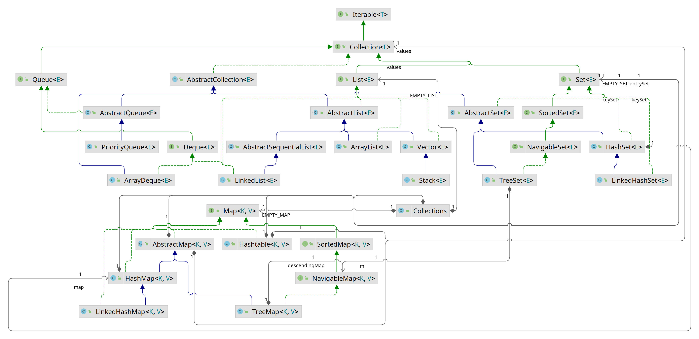
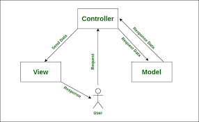
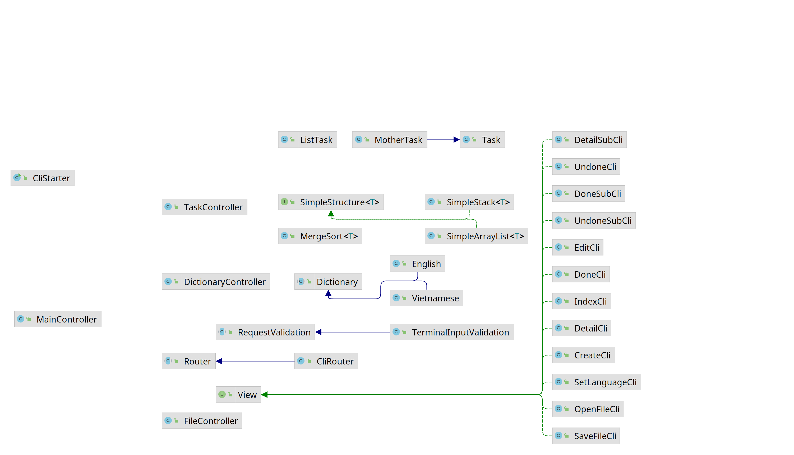
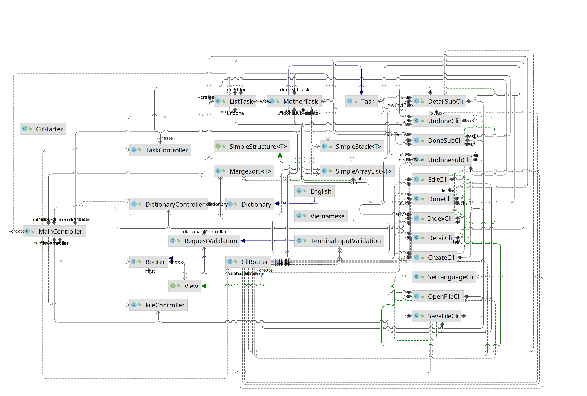

word https://1drv.ms/w/s!AlK0dj0v2W4fgR9LmtHEO2b8uO1e

# Ứng dụng To Do List

## A. Các định nghĩa khái niệm liên quan

### I. Java Collections Framework

Một framework cung cấp kiến trúc và thao tác tới nhóm các đối tượng bao gồm các thao tác như xem, thêm, xóa, tìm kiếm,
sắp xếp, phân loại.
Collections có ưu điểm hơn Array không cần phải gán dung lượng mà dung lượng có thể thay đối tùy vào số lượng đối tượng
lưu trữ nhưng bù lại Collection không thể lưu các biến nguyên thủy mà chỉ có thể lưu các Wrapper class của biến nguyên
thủy. Bù lại thì Java linh hoạt trong việc chuyển đổi (boxing và unboxing) từ primitive type sang wrapper class và ngược
lại nên không gây ảnh hưởng nhiều.  
Framework nằm trọn trong package java.utils gồm 2 bộ chính là Map và Collection. Đây chính là cấu trúc dữ liệu chính và
phổ biến nhất của Java

Những interface chính của Collections Framework:

* Collection: định nghĩa phần cơ bản nhất của mọi collection bao gồm các thao tác như thêm (add()), xóa (remove()) hay
  kiểm tra sự tồn tại (contains()). Collection là interface con của java.lang.Iterable nên mọi collection đều có thể sử
  dụng foreach đồng thời Collection sử dụng kiểu generic nên có thể lưu mọi class. Collection gồm 3 interface con:
    * Set: một Collection không thể chứa 2 giá trị trùng lặp
    * List: một collection có thứ tự, có thể chứa các giá trị trùng lặp, truy cập các phần tử dựa trên index của chúng
    * Queue: một collection chứa các phần tử xử lý (hàng đợi) với thứ tự FIFO(first in - first out). Queue có một
      interface con là Deque giúp phần tử có thể chèn và lấy ra từ cả hai đầu (thêm LIFO (last in - first out))
* Map: là một đối tượng ánh xạ mỗi cặp Key - Value, mỗi Key ánh xạ một Value và danh sách Key không trùng lặp

Ngoài ra Collections Framework còn một class chỉ bao gồm các hàm và biến static là Collections để làm công cụ hỗ trợ cho
người dùng trong việc sắp xếp, tìm kiếm, vv

Trong khuôn khổ đề tài, chúng ta sẽ nói về ArrayList, Vector và Stack

1. ArrayList
    - là class implement từ interface List
    - ArrayList có chứa một biến thành viên là một mảng Object đồng thời ArrayList được thiết kế để tự mở rộng mảng khi
      mảng đó đầy nên kích thước của ArrayList không cố định
    - ArrayList duy trì thứ tự được thêm vào
    - Truy cập theo index nên có thể truy cập ngẫu nhiên nhưng bù lại, khi chèn, xóa sẽ dịch mảng hay đánh lại index
      nên thao tác chậm
2. Vector và Stack
    - Cũng như ArrayList, Vector cũng implement từ interface List, các hàm của Vector cũng không khác ArrayList
    - Các hàm của Vector đều yêu cầu synchronized (đồng bộ) tức chỉ có 1 thread được hoạt động trên 1 Vector
    - Vector có 1 class con là Stack hoạt đông theo cơ chế FIFO(first in - first out). Giả sử nếu 1 worker lấy phần tử ở
      vị trí đầu tiên ra rồi xóa mà chưa chạy đến đoạn giảm số phần tử thì 1 worker khác có thể lấy nhầm phần tử ở vị
      trí vừa xóa lúc đó đang là null, tính toán sẽ bị sai. Nhờ cơ chế synchronized nên khi nhiều Thread cùng truy cập
      vào Stack sẽ an toàn hơn ArrayList.
    - Test: [SyncTest](src/main/java/blaplafla/todolist/models/test/SyncTest.java)
        - Tạo 2 đối tượng ArrayList và Stack ứng với mỗi đối tượng tạo 2 luồng add 5000 phần tử
        - Start 4 luồng trên và join lại
        - ArrayList sẽ không luôn cho ra kết quả là 10000 như Stack thậm chí còn phát sinh lỗi
          ArrayIndexOutOfBoundsException

### II. MergeSort

- Giải thuật sắp xếp trộn (Merge Sort) là thuật toán sắp xếp hiệu quả sử dụng thuật toán Divide and Conquer (chia để
  trị)
- Thuật toán hoạt động khá đơn giản:
    - Ở bước chia, chia đôi nhiều lần mảng ban đầu thành các mảnh con cho đến khi mỗi mảnh có kích thước là 1 hoặc 2.
      Khi đó sắp xếp mảng trong mảng con đơn giản chỉ là so sánh hai phần tử.
    - Ở bước trị, các mảng sẽ gộp lại với nhau, do các mảng đã sắp xếp ở trên nên chỉ cần so sánh giá trị đầu tiên của
      và chuyển vào mảng kết quả
- Thuật toán được sử dụng nhiều do:
    - Thuật toán đơn giản, ổn định
    - Độ phức tạp thời gian thấp O(nlogn) trong mọi trường hợp
    - Độ phức tạp không gian là O(n)
    - Nhờ việc chia nhỏ các mảng để xử lý độc lập, thuật toán dễ dàng hoạt động trên đa luồng để xử lý nhanh hơn, hiệu
      quả hơn, sử dụng tối đa tài nguyên phần cứng. Thay vì chia đôi có thể chia thành nhiều mảnh hơn cho nhiều luồng xử
      lý một lúc nên đặc biệt thích hợp cho dữ liệu lớn.
- Trong khoa học máy tính, một thuật toán sắp xếp ổn định bảo toàn thứ tự tương đối các bản ghi với nhau theo một khóa.
- Nhược điểm:
    - So sánh chậm hơn với các thuật toán khác với bộ dữ liệu nhỏ
    - Đòi hỏi một bộ nhớ tạm O(n) để chia nhỏ và xử lý khi làm việc với mảng (sắp xếp ngoài mảng ban đầu) vậy nên thuật
      toán chủ yếu sử dụng với LinkedList và chia nhiều như vậy rồi gọi đệ quy cũng dễ gây lỗi StackOverFlow
    - Thuật toán mỗi lần sắp xếp sẽ chạy trên toàn bộ mảng nên bất kể mảng đã được sắp xếp hay chưa vẫn tốn một lượng
      thời gian

### III. Mô hình MVC

- MVC hay Model-View-Controller là một mô hình thiết kế phần mềm phổ biến được sử dụng để phát triển chương trình giao
  diện người dùng.
- Như tên gọi, MVC gồm 3 thành phần chính độc lập với nhau
    - Model: Quản lý dữ lệu, logic và các quy tắc, Model thường thao tác với cơ sở dữ liệu hoặc các list dữ liệu
    - View: là giao diện cho người dùng xem và gửi các yêu cầu tới Controller
    - Controller: đóng vai trò quản lý, tiếp nhận yêu cầu của gửi dùng để thao tác trên Model.
    - Ngoài ra mô hình có thể mở rộng ra thêm nhiều các thành phần khác để phục vụ việc xử lý yêu cầu của người dùng.
- Về cơ bản chương trình được xử lý như sau:
    - Bước 1: Người dùng gửi yêu cầu (request) cho Controller, Controller tiếp nhận
    - Bước 2: Controller kiểm tra request đầu vào, nếu liên quan đến dữ liệu sẽ gửi yêu cầu xử lý đến Model
    - Bước 3: Khi Model nhận yêu cầu từ Controller, Model sẽ truy xuất dữ liệu tính toán và xử lý để trả về Controller
    - Bước 4: Sau khi nhận dữ liệu của Model, Controller sẽ tiếp tục xử lý và gọi đến View cùng dữ liệu
    - Bước 5: View hiện thị ra dữ liệu cho người sử dụng và trở thành giao diện cho người dùng gửi yêu cầu lên
      Controller

  
- Ưu điểm của mô hình:
    - Các thành phần tách biệt hoàn toàn với nhau chỉ gọi qua nhau thông qua các yêu cầu nên dễ dàng quản lý, nâng cấp,
      sửa chữa. Một phần bị hỏng thì chỉ có thể hỏng trong phạm vi Controller đó quản lý, sửa, nâng cấp một phần thì tất cả vẫn có
      thể hoạt động bình thường theo thay đổi mới
    - Nhiều View: Do các thành phần tách biệt nên phát triển các View khác nhau hoàn toàn dễ dàng, một chương trình có
      thể chạy trên nhiều giao diện khác nhau như thông qua giao diện dòng lệnh hay giao diện đồ họa.
- Nhược điểm là
    - Phức tạp khi xây dựng ban đầu hoặc hiểu code sẵn có khi tham gia vào dự án
    - Nhiều quy tắc phải theo (do tính khuôn mẫu của nó)

## B. Giới thiệu bài toán

### I. To-do List và Task Priority

###### _Danh sách công việc cần làm và mức độ ưu tiên công việc_

1. Lý do, tính cấp thiết

- Cuộc sống ngày càng bận rộn, số lượng công việc ngày càng nhiều, khi đến một mức nhất định, chúng ta không thể quản lý
  được hiệu quả.
- Những ứng dụng To-do List phổ biến hiện nay như Google Tasks, Microsoft To Do không có lựa chọn đặt mức độ ưu tiên của
  công việc rồi tự động sắp xếp thứ tự ưu tiên, buộc người dùng phải tự sắp xếp bằng tay nên không hiệu quả, các nhiệm
  vụ dễ bị chìm xuống dưới rơi vào quên lãng

⇨ Đòi hỏi một ứng dụng có thể tự động sắp xếp thứ tự công việc theo ưu tiên của người dùng

2. Mô tả bài toán

- Người dùng nhập các thông tin của công việc cũng như mức độ ưu tiên là một số dương.
- Điểm của công việc được tính bằng công thức (thời gian hạn chót - thời gian hiện tại) / mức độ ưu tiên với thời gian
  còn lại dương và thời gian còn lại * độ ưu tiên nếu thời gian còn lại trở thành âm
- Mức độ ưu tiên càng cao, càng sát deadline thì tử càng giảm, mẫu càng cao, phân số càng nhỏ điểm của công việc càng
  thấp, như vậy khi sắp xếp thứ tự công việc theo điểm tăng dần, công việc càng gấp sẽ nổi lên trên, công việc còn nhiều
  thời gian, độ ưu tiên thấp sẽ ở dưới.
- Do yêu cầu bài toán, để chính xác thuật toán được chọn phải xử lý nhanh với tốc độ thời gian thực (dưới 1s)

### II. Áp dụng cấu trúc dữ liệu và giải thuật vào bài toán

1. Cấu trúc dữ liệu (datastructures)

- Sử dụng List để lưu dữ liệu
- Trong bài xây dựng lại 2 class ArrayList thành SimpleArrayList và Stack thành SimpleStack
    - SimpleArrayList implement từ SimpleDataStructure với kiểu Generic các phần tử có class cha là Comparable tiện cho
      việc sắp xếp mảng, sử dụng để lưu trữ công việc chưa hoàn thành
    - SimpleStack implement từ SimpleDataStructure với kiểu Generic với index và Iterator có thứ tự ngược lại thứ tự
      nhập vào dùng để lưu công việc đã hoàn thành

2. Thuật toán sắp xếp

- Sử dụng thuật toán Merge Sort
- Thuật toán Merge Sort được cài đặt dưới dạng một object và được lưu làm biến thành viên của SimpleArrayList để thuận
  tiện cho việc sắp xếp
- Class MergeSort được thiết kế chạy đa luồng trên hai mảng dữ liệu riêng biệt tách ra từ mảng đầu vào để tận dụng phần
  cứng tăng tốc xử lý
- MergeSort làm bến thành viên của SimpleArrayList để tiện sắp xếp

3. Mô hình

- Chương trình sử dụng mô hình MVC mở rộng
    - Controller:
        - Bao gồm MainController cùng các các Controller phụ
            - TaskController: quản lý đối tượng Task
            - FileController: quản lý nhập xuất dữ liệu file
            - DictionaryController: quản lý ngôn ngữ và nhập liệu
        - MainController là 1 singleton bao gồm các Controller phụ và Router nhằm quản lý nhất quán
        - Controller phụ sẽ là hằng sau khi khai báo để đảm bảo không bị lỗi liên quan đến các biến thành viên trong
          Controller phụ bị thay đổi khi thay Controller phụ
        - Router của chương trình cũng sẽ lưu tại đây để thuận tiện cho việc gọi các View
    - Router:
        - Router là class mang nhiệm vụ điều hướng đến các views tương ứng cũng như nhận các request người dùng nhập
          vào.
        - MainController sử dụng Strategy Pattern để thay đổi Router linh hoạt, đồng thời có các hàm để gọi các view và
          request từ Router để các controller cũng như view có thể gọi thông qua MainController mà không cần phải xác
          định xem view mình cần gọi đến có đúng không, đảm bảo tính nhất quán cũng như tách biệt các thành phần của
          chương trình
    - Model:
        - Lưu các dữ liệu của chương trình, ngoại trừ từ điển tất cả đều implement class Serialize để có thể ghi ra file
            - Thuật toán sắp xếp (aglorithms)
                - Sử dụng thuật toán MergeSort trong class MergeSort
                - Thuật toán sử dụng 2 luồng để mỗi luồng xử lý 1 nửa mảng nhằm sử dụng tối đa hiệu suất tài nguyên phần
                  cứng
            - Cấu trúc dữ liệu (datastructures)
                - Gồm Interface SimpleStructure cùng 2 class SimpleStack mô phỏng lại Stack và SimpleArrayList mô phỏng
                  lại ArrayList
            - Từ điển (dictionary)
                - cho việc sử dụng nhiều ngôn ngữ
                - Gồm Interface Dictionary và 2 file ngôn ngữ Vietnamese và English
                - Sử dụng làm biến thành viên cho DictionaryController
                - Sử dụng Design Pattern Strategy để có thể thay đổi ngôn ngữ linh hoạt
            - Đối tượng Task và ListTask(task)
                - Class ListTask để quản lý tổng các task, gồm các hàm để quản lý cùng với 2 list:
                    - SimpleArrayList undone để lưu các việc chưa hoàn thành
                    - SimpleStack done để lưu các việc đã hoàn thành
                    - ListTask đóng vai trò như 1 cơ sở dữ liệu quản lý tất cả các Task cùng với các hàm để xử lý các
                      vấn đề người dùng yêu cầu.
                    - ListTask được quản lý bởi MainController và được các Controller con gọi đến
                - Class Task là object thể hiện cho từng công việc
                    - gồm các hàm setter và getter cho 4 thuộc tính
                        - Tiêu đề
                        - Mô tả
                        - Thời hạn
                        - Độ ưu tiên
                    - Các hàm tính toán thời gian còn lại, điểm, các hàm so sánh
                    - Điểm dựa trên công thức (thời gian còn lại / độ ưu tiên) nếu chưa trễ hạn và (thời gian còn lại *
                      độ
                      ưu tiên) nếu đã trễ hạn
                    - Mother Task là mở rộng của Task với thêm 2 List tương tự ListTask là
                        - SimpleArrayList undoneSubTask để lưu các việc con chưa hoàn thành
                        - SimpleStack doneSubTask để lưu các việc con đã hoàn thành
        - Request:
            - Xử lý đầu vào người dùng nhập của chương trình
            - RequestValidation là class cha có extend là
                - TerminalInputValidation dùng để nhập liệu từ Terminal
        - View:
            - Hiển thị thông tin cho người sử dụng
            - Interface View với 2 method run() không đối và run() có đối để chạy với 2 điều kiện: có đối truyền vào và
              không có đối truyền vào
            - Các package theo từng gói giao diện của View, các giao diện được mô tả ở C.II
- Sơ đồ quan hệ:
  
  
## C. Mô tả chương trình ứng dụng

### I. Tính năng:

1. Các tính năng đã hoàn thiện

- Xem thêm sửa xóa task
- Sắp xếp Task tự động theo thứ tự ưu tiên và thời gian
- Đổi ngôn ngữ

2. Các tính năng chưa phát triển và có thể phát triển thêm

- Sắp xếp thêm các task con trực tiếp ở index
- Lặp lại
- Thông báo

### II. Giao diện

| Tên                                                                |   CLI   |   GUI    |
|:-------------------------------------------------------------------|:-------:|:--------:|
| Trang đổi ngôn ngữ SetLanguage                                  | &#9745; | &#9744;  |
| Nhập file OpenFile                                              | &#9745; | &#9744;  |
| Lưu file SaveFile                                               | &#9745; | &#9744;  |
| Danh sách các việc cần làm + việc cuối cùng đã hoàn thành Index | &#9745; | &#9744;  |
| Danh sách các việc chưa hoàn thành Undone                       | &#9745; | &#9744;  |
| Danh sách các việc đã làm Done                                  | &#9745; | &#9744;  |
| Tạo việc mới (MotherTask&Task) Create                           | &#9745; | &#9744;  |
| Sửa việc đã tạo (MotherTask&Task)  Edit                         | &#9745; | &#9744;  |
| Xem chi tiết việc (Sửa Xóa Tích hoàn thành) Detail              | &#9745; | &#9744;  |
| Xem chi tiết việc con (Sửa Xóa Tích hoàn thành) DetailSubTask   | &#9745; | &#9744;  |
| Danh sách các việc con chưa hoàn thành UndoneSub                | &#9745; | &#9744;  |
| Danh sách các việc con đã làm DoneSub                           | &#9745; | &#9744;  |

&#9745; hoàn tất  
&#9744; đang làm

### III. Mô tả từng giao diện
1. Create (Tạo việc mới)

| Luồng | Đối tượng                                                                         |
|:------|:----------------------------------------------------------------------------------|
| Vào   | ListTask hoặc MotherTask                                                          |
| Ra    | Task mới với các thông tin về tên, mô tả, deadline, độ ưu tiên do người dùng nhập |

2. Detail (Xem chi tiết)

| Luồng | Đối tượng                                                                                                                                                                                                                                                                                                                                                                                                                                                                     |
|:------|:------------------------------------------------------------------------------------------------------------------------------------------------------------------------------------------------------------------------------------------------------------------------------------------------------------------------------------------------------------------------------------------------------------------------------------------------------------------------------|
| Vào   | MotherTask                                                                                                                                                                                                                                                                                                                                                                                                                                                                    |
| Ra    | - Các thông tin về công việc: tên, mô tả, thời gian hết hạn, độ ưu tiên  - Thông tin của công việc con (số lượng, tên, mô tả, tiến độ...) (nếu có)  - Nhận lệnh từ người dùng nhập vào:  + Sửa (edit),  + Thêm (add), + Xóa (delete), + Chuyển đổi trạng thái hoàn thành (toggle), + Quay lại (back), + Trang kế (next),  + Trang trước (prev),  + Danh sách đã hoàn thành (done list), + Danh sách chưa hoàn thành (undone list) |

3. DetailSubTask (Xem chi tiết việc con)

| Luồng | Đối tượng                                                                                                                                                                                                                      |
|:------|:-------------------------------------------------------------------------------------------------------------------------------------------------------------------------------------------------------------------------------|
| Vào   | MotherTask, Task                                                                                                                                                                                                               |
| Ra    | - Tên task mẹ - Tên task con, mô tả, thời gian hết hạn, độ ưu tiên  - Nhận lệnh từ người dùng nhập vào:  + Sửa (edit),  + Xóa (delete), + Chuyển đổi trạng thái hoàn thành (toggle), + Quay lại (back) |

4. Done (Danh sách đã làm)

| Luồng | Đối tượng                                                                                                                                                                                                                                                                                                |
|:------|:---------------------------------------------------------------------------------------------------------------------------------------------------------------------------------------------------------------------------------------------------------------------------------------------------------|
| Vào   | ListTask                                                                                                                                                                                                                                                                                                 |
| Ra    | - Danh sách các việc đã hoàn thành theo trang bao gồm tên, mô tả và số lượng các công việc con   - Nhận lệnh từ người dùng nhập vào:  + Sửa (edit), + Xóa (delete), + Chuyển đổi trạng thái hoàn thành (toggle), + Quay lại (back), + Trang kế (next),  + Trang trước (prev) |

5. DoneSub (Danh sách các việc con đã hoàn thành)

| Luồng | Đối tượng                                                                                                                                                                                                                                                                      |
|:------|:-------------------------------------------------------------------------------------------------------------------------------------------------------------------------------------------------------------------------------------------------------------------------------|
| Vào   | MotherTask                                                                                                                                                                                                                                                                     |
| Ra    | - Danh sách các task con đã hoàn thành theo trang bao gồm tên, mô tả   - Nhận lệnh từ người dùng nhập vào:  + Sửa (edit), + Xóa (delete), + Chuyển đổi trạng thái hoàn thành (toggle), + Quay lại (back), + Trang kế (next),  + Trang trước (prev) |

6. Edit (Sửa việc đã tạo)

| Luồng | Đối tượng                                                                          |
|:------|:-----------------------------------------------------------------------------------|
| Vào   | Task (MotherTask hoặc Sub Task)                                                    |
| Ra    | Task cũ với các thông số (tên, mô tả, deadline, độ ưu tiên) mới do người dùng nhập |

7. Index (Danh sách các việc cần làm + việc cuối cùng đã hoàn thành)

| Luồng | Đối tượng                                                                                                                                                                                                                                                                                                                                                                                                                                                              |
|:------|:-----------------------------------------------------------------------------------------------------------------------------------------------------------------------------------------------------------------------------------------------------------------------------------------------------------------------------------------------------------------------------------------------------------------------------------------------------------------------|
| Vào   | ListTask                                                                                                                                                                                                                                                                                                                                                                                                                                                               |
| Ra    | - Tên công việc, mô tả, thời gian còn lại, số task con chưa hoàn thành của 1 task - Công việc hoàn thành cuối cùng - Nhận lệnh từ người dùng nhập vào:   + Thêm (add),  + Trang kế (next),  + Trang trước (prev), + Mở (open file),  + Lưu (save file) + Đặt username (set username); + Cài đặt ngôn ngữ (set lang)  + Danh sách đã hoàn thành (done list), + Danh sách chưa hoàn thành (undone list),  + Thoát (exit) |

8. OpenFile (Nhập file)

| Luồng | Đối tượng                 |
|:------|:--------------------------|
| Vào   | Đường dẫn tới file (path) |
| Ra    | Dữ liệu từ file           |

9. SaveFile (Lưu file)

| Luồng | Đối tượng       |
|:------|:----------------|
| Vào   | Yêu cầu lưu     |
| Ra    | Dữ liệu ra file |

10. Set Language (Đổi ngôn ngữ)

| Luồng | Đối tượng                |
|:------|:-------------------------|
| Vào   | Ngôn ngữ người dùng chọn |
| ra    | Thay đổi ngôn ngữ        |

11. Undone (Danh sách chưa hoàn thành)

| Luồng | Đối tượng                                                                                                                                                                                                                                                                                                 |
|:------|:----------------------------------------------------------------------------------------------------------------------------------------------------------------------------------------------------------------------------------------------------------------------------------------------------------|
| Vào   | ListTask                                                                                                                                                                                                                                                                                                  |
| Ra    | - Danh sách các việc chưa hoàn thành theo trang bao gồm tên, mô tả và task con   - Nhận lệnh từ người dùng nhập vào: + Thêm (add)  + Sửa (edit), + Xóa (delete), + Chuyển đổi trạng thái hoàn thành (toggle), + Quay lại (back), + Trang kế (next),  + Trang trước (prev) |

12. UndoneSub (Danh sách các việc con chưa hoàn thành)

| Luồng | Đối tượng                                                                                                                                                                                                                                                                                                       |
|:------|:----------------------------------------------------------------------------------------------------------------------------------------------------------------------------------------------------------------------------------------------------------------------------------------------------------------|
| Vào   | MotherTask                                                                                                                                                                                                                                                                                                      |
| Ra    | - Số các task con chưa hoàn thành theo trang bao gồm tên, mô tả và thời gian còn lại   - Nhận lệnh từ người dùng nhập vào: + Thêm (add)  + Sửa (edit), + Xóa (delete), + Chuyển đổi trạng thái hoàn thành (toggle), + Quay lại (back), + Trang kế (next),  + Trang trước (prev) |

## Tài liệu tham khảo

- Java Docs 17
- GeeksForGeeks
- Baeldung.com
